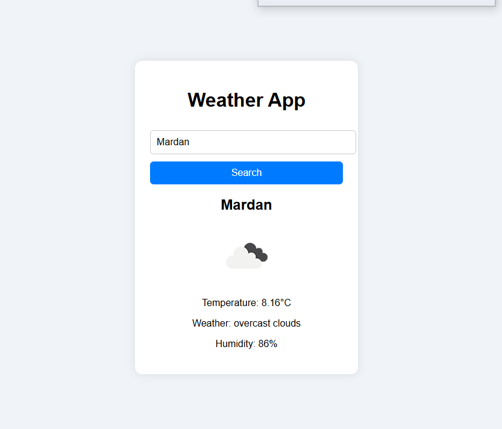

# 🌦️ Weather App

A simple and responsive Weather Application built with HTML, CSS, and JavaScript, utilizing the OpenWeatherMap API.

## Features

- Search weather by city name  
- Displays temperature, humidity, weather description, and icon  
- Responsive design for mobile and desktop  
- Data persistence and user-friendly interaction

## Demo

## Live Demo

[View Live Weather App](https://umaarzaman.github.io/Weather-App/)

## Technologies Used

- HTML  
- CSS  
- JavaScript  
- OpenWeatherMap API  

## Author

Umar Farooq  
BS Computer Science Student

---

Feel free to fork and improve this project!  
